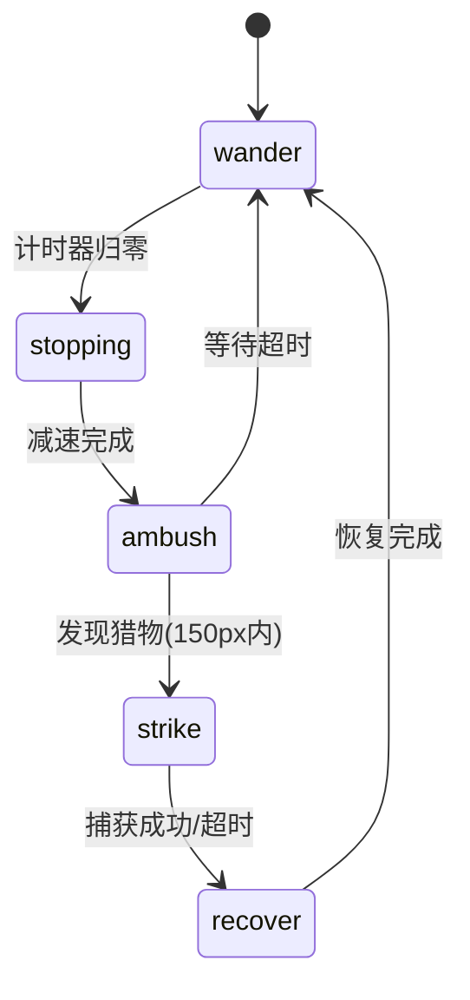
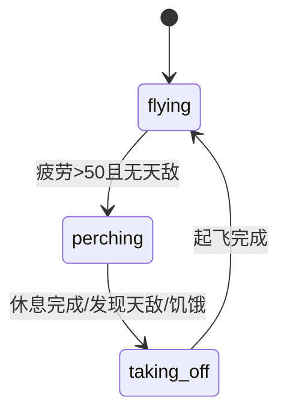

# Design Document

## Overview

生物进化模拟器，包含四种物种和两条食物链：
- **蚂蚁** → **食蚁兽**
- **蚂蚁/鸟** → **蛇**（蛇主要捕食鸟类）

蚂蚁使用蚁群算法（信息素），鸟使用鸟群算法（Boids）。蛇使用伏击策略，食蚁兽使用追逐策略。所有物种都可以繁殖和进化。

### 技术选型

- HTML5 + Canvas + JavaScript（无框架）
- 直接在浏览器运行
- 支持触摸设备

## Architecture

```
index.html + styles.css
         │
         ▼
      main.js (游戏主循环、摄像机、事件处理)
         │
    ┌────┼────┬────────┬────────┐
    ▼    ▼    ▼        ▼        ▼
config.js world.js  creature.js gene.js  pheromone.js
(配置)   (世界/植物) (生物基类) (基因系统) (信息素网格)
              │
         ┌────┼────┬────────┐
         ▼    ▼    ▼        ▼
      ant.js bird.js  predator.js
      (蚂蚁)  (鸟)    (食蚁兽/蛇)
```

## Components and Interfaces

### 1. Creature 基类 (creature.js)

```javascript
class Creature {
  constructor(x, y, type, gene = null)
  
  // 位置和速度
  x, y: number              // 位置
  vx, vy: number            // 速度向量（归一化）
  
  // 基因系统
  gene: {
    speed: number,          // 速度
    perception: number,     // 感知范围
    size: number            // 体型
  }
  
  // 状态
  energy: number            // 能量
  isAlive: boolean          // 是否存活
  generation: number        // 代数
  reproductionCooldown: number  // 繁殖冷却
  pregnancyTimer: number    // 怀孕计时器
  
  // 外观
  size: number              // 实际尺寸
  color: string             // 颜色
  
  // 方法
  update()                  // 更新（子类实现）
  draw(ctx)                 // 绘制（子类实现）
  move(speedMultiplier)     // 基础移动
  wander(turnAmount)        // 随机漫游
  moveTowards(x, y, turnRate)  // 朝目标移动
  fleeFrom(target)          // 逃离目标
  normalizeVelocity()       // 归一化速度
  consumeEnergy(base, speed, size)  // 消耗能量
  die()                     // 死亡
  findNearest(targets, maxDist, filter)  // 寻找最近目标
  distanceTo(target)        // 计算距离
  canReproduce()            // 检查是否可繁殖
  startPregnancy()          // 开始怀孕
  mutateGene()              // 基因变异
  getInfo()                 // 获取信息
}
```

### 2. Ant 蚂蚁类 (ant.js)

```javascript
class Ant extends Creature {
  // 蚁巢关联
  nestX, nestY: number      // 蚁巢位置
  
  // 状态
  hasFood: boolean          // 是否携带食物
  fleeTimer: number         // 逃跑计时器
  isInsideNest: boolean     // 是否在巢内
  stayInNestTimer: number   // 巢内休息计时器
  
  // 方法
  update(world, pheromoneGrid, predators, neighbors)
  leaveNest()               // 离开蚁巢
  separate(neighbors)       // 分离行为（避免重叠）
  moveAnt(world)            // 蚂蚁移动
  searchForFood(world, pheromoneGrid)  // 搜索食物
  followPheromone(grid)     // 跟随信息素
  depositPheromone(grid)    // 释放信息素（携带食物时双倍）
  returnToNest()            // 返回蚁巢
  checkNestArrival()        // 检查是否到达蚁巢
  checkFoodPickup(world)    // 检查是否拾取食物
  findNearbyPredator(predators)  // 寻找附近捕食者
  draw(ctx)                 // 绘制（头、胸、腹、触角、腿）
}

class AntNest {
  x, y: number              // 位置
  foodStored: number        // 储存的食物
  size: number              // 尺寸
  maxAnts: number           // 最大蚂蚁数（50）
  spawnCooldown: number     // 生成冷却
  spawnInterval: number     // 生成间隔（60帧）
  antCount: number          // 当前蚂蚁数
  
  update(ants, pheromoneGrid)  // 更新（可能生成新蚂蚁）
  canSpawnAnt(ants)         // 检查是否可生成
  spawnAnt()                // 生成蚂蚁（消耗2食物）
  storeFood(amount)         // 存储食物
  draw(ctx)                 // 绘制（显示食物和蚂蚁数量）
}
```

### 3. Bird 鸟类 (bird.js)

```javascript
class Bird extends Creature {
  // Boids 参数
  maxSpeed: number          // 最大速度
  maxForce: number          // 最大转向力（0.1）
  separationWeight: number  // 分离权重（1.5）
  alignmentWeight: number   // 对齐权重（1.0）
  cohesionWeight: number    // 聚合权重（1.0）
  perceptionRadius: number  // 感知半径
  separationRadius: number  // 分离半径（感知的40%）
  
  // 状态机
  state: 'flying' | 'perching' | 'taking_off'
  stateTimer: number        // 状态计时器
  fatigue: number           // 疲劳度（0-100）
  
  // 方法
  update(world, birds, ants, predators)
  updateState(predators)    // 更新状态机
  land()                    // 降落栖息
  takeOff()                 // 起飞
  updateFlight(world, birds, ants, predators)  // 更新飞行
  moveBird()                // 移动
  limitSpeed()              // 限制速度
  
  // Boids 三规则
  separation(neighbors)     // 分离：避免碰撞
  alignment(neighbors)      // 对齐：方向一致
  cohesion(neighbors)       // 聚合：靠近中心
  flock(birds)              // 组合三规则
  getNeighbors(birds)       // 获取邻居
  
  // 觅食和逃跑
  seekFood(world, ants)     // 寻找食物
  checkFoodPickup(world, ants)  // 检查拾取
  findNearbyPredator(predators)  // 寻找捕食者（蛇伏击时难发现）
  flee(predator)            // 逃跑
  
  reproduce()               // 繁殖
  draw(ctx)                 // 绘制（飞行/栖息两种形态）
}
```

### 4. Predator 捕食者类 (predator.js)

```javascript
class Predator extends Creature {
  // 捕猎系统
  huntCooldown: number      // 捕猎冷却
  
  // 体能管理系统
  energyHistory: number[]   // 能量历史记录
  historyTimer: number      // 历史记录计时器
  energyDropRate: number    // 能量下降速率
  fatigueFactor: number     // 疲劳因子（0.5-1.0）
  isHunting: boolean        // 是否正在捕猎
  
  // 方法
  updateStamina()           // 更新体能
  hunt(target, turnRate)    // 追捕目标
  catchPrey(prey, energyGain)  // 捕获猎物
  checkCatch(preyList, radius, energyGain)  // 检查捕获
  reproduceChild(ChildClass)  // 繁殖
}

class Anteater extends Predator {
  // 食蚁兽特有
  wanderAngle: number       // 漫游角度
  
  update(world, ants)
  wanderSmooth()            // 平滑漫游
  reproduce()
  draw(ctx)                 // 绘制（身体、头、长鼻子、尾巴、腿）
}

class Snake extends Predator {
  // 伏击系统状态机
  state: 'wander' | 'stopping' | 'ambush' | 'strike' | 'recover'
  stateTimer: number
  strikeTarget: Bird | null
  
  // 蛇身体
  bodySegments: {x, y}[]    // 身体段（24节）
  maxSegments: number
  segmentSpacing: number    // 段间距
  
  update(world, birds)
  updateState(birds)        // 状态机更新
  wanderSnake()             // 蛇形漫游（波动）
  huntStrike(target)        // 突袭追捕（3.5倍速）
  move()                    // 移动（根据状态调整速度）
  updateBodySegments()      // 更新身体段位置
  reproduce()
  draw(ctx)                 // 绘制（渐变身体、花纹、头部、眼睛、舌头）
}
```

### 5. PheromoneGrid 信息素网格 (pheromone.js)

```javascript
class PheromoneGrid {
  // 使用 Map 实现稀疏网格（支持无限世界）
  grid: Map<string, number>  // Key: "row,col", Value: strength
  cellSize: number          // 网格单元大小（10像素）
  evaporationRate: number   // 蒸发率（0.995）
  maxStrength: number       // 最大浓度（255）
  visible: boolean          // 是否可视化
  
  initGrid()                // 初始化
  worldToGrid(x, y)         // 世界坐标转网格坐标
  isInBounds(x, y)          // 检查有效性
  deposit(x, y, amount)     // 释放信息素
  evaporate(rate)           // 蒸发（删除低浓度记录）
  getStrength(x, y)         // 获取浓度
  getSurroundingStrength(x, y, radius)  // 获取周围浓度
  getStrongestDirection(x, y, radius)   // 获取最强方向
  draw(ctx)                 // 绘制可视化
  toggleVisibility()        // 切换显示
  getStats()                // 获取统计信息
}
```

### 6. World 世界类 (world.js)

```javascript
class Plant {
  x, y: number
  energy: number            // 食物能量
  size: number              // 尺寸（4）
  color: string             // 颜色（#4ecdc4）
  
  draw(ctx)                 // 绘制（带发光效果）
}

class World {
  baseWidth, baseHeight: number  // 基础尺寸
  width, height: number     // 当前尺寸
  plants: Plant[]           // 植物列表
  maxPlants: number         // 最大植物数
  plantSpawnRate: number    // 生成率
  
  // 动态边界
  viewBounds: {
    minX, minY, maxX, maxY: number
  }
  
  init()                    // 初始化
  updateViewBounds(camera, canvasWidth, canvasHeight)  // 更新边界
  spawnPlant(x, y)          // 生成植物
  update(camera, canvasWidth, canvasHeight)  // 更新
  removePlant(plant)        // 移除植物
  getPlantNear(x, y, radius)  // 获取附近植物
  getNearestPlant(x, y, maxDistance)  // 获取最近植物
  isInBounds(x, y, padding) // 检查边界
  clampToBounds(x, y, padding)  // 限制到边界
  draw(ctx)                 // 绘制
  getPlantCount()           // 获取植物数量
}
```

### 7. Gene 基因系统 (gene.js)

```javascript
const GeneUtils = {
  createDefaultGene(speciesType)  // 创建默认基因
  mutate(parentGene, mutationRate, mutationAmount)  // 基因变异
  crossover(gene1, gene2)   // 基因交叉（可选）
  calculateFitness(gene, speciesType)  // 计算适应度
  formatGene(gene)          // 格式化显示
}

const ReproductionUtils = {
  canReproduce(creature, threshold)  // 检查可否繁殖
  getReproductionCooldown(speciesType)  // 获取冷却时间
  getPregnancyDuration(speciesType)  // 获取怀孕时间
  getReproductionCost(speciesType)  // 获取繁殖消耗
  getOffspringEnergy(speciesType)  // 获取后代能量
  getSpawnOffset(speciesType)  // 获取生成偏移
}

const DeathUtils = {
  shouldDie(creature)       // 检查是否应死亡
  handleDeath(creature, world)  // 处理死亡（生成植物）
}
```

### 8. Main 主控 (main.js)

```javascript
// 全局状态
canvas, ctx: CanvasRenderingContext2D
isPaused: boolean
selectedSpecies: string
generation: number

// 摄像机
camera: {
  x, y: number,             // 位置
  zoom: number,             // 缩放（0.2-3）
  minZoom, maxZoom: number,
  isDragging: boolean,
  lastX, lastY: number
}

// 生物存储
creatures: Creature[]
antNests: AntNest[]
world: World
pheromoneGrid: PheromoneGrid

// 拖拽状态
dragState: {
  isDragging: boolean,
  species: string,
  startX, startY: number,
  currentX, currentY: number,
  count: number
}

// 触摸状态
touchState: {
  lastX, lastY: number,
  lastDist: number,
  isDragging, isPinching: boolean,
  touchStartTime: number
}

// 主要函数
init()                      // 初始化
centerCamera()              // 居中摄像机
screenToWorld(sx, sy)       // 屏幕坐标转世界坐标
resizeCanvas()              // 调整画布大小
setupEventListeners()       // 设置事件监听
setupTouchListeners()       // 设置触摸监听
handleTouchStart/Move/End() // 触摸处理
onWheel(e)                  // 滚轮缩放
onCanvasMouseMove/Down/Up() // 鼠标事件
onKeyDown(e)                // 键盘事件
togglePause()               // 暂停/继续
resetGame()                 // 重置游戏
onCanvasClick(e)            // 点击放置
spawnCreature(x, y, type, count)  // 生成生物
spawnAnt(x, y)              // 生成蚂蚁
findNearestNest(x, y, maxDistance)  // 查找蚁巢
updateStatusBar()           // 更新状态栏
gameLoop()                  // 游戏主循环
update()                    // 更新逻辑
handleReproduction()        // 处理繁殖
updateGeneration()          // 更新代数
draw()                      // 绘制
drawDragPreview()           // 绘制拖拽预览
drawGrid()                  // 绘制网格背景
```

## Data Models

### 物种配置 (config.js)

```javascript
const SPECIES = {
  ant: {
    name: '蚂蚁',
    color: '#D2691E',       // 棕色
    size: 3,
    baseGene: { speed: 1.8, perception: 60, size: 1 },
    prey: [],
    predators: ['anteater', 'bird']
  },
  bird: {
    name: '鸟',
    color: '#4169E1',       // 皇家蓝
    size: 8,
    baseGene: { speed: 5, perception: 60, size: 3 },
    prey: ['ant', 'food'],
    predators: ['snake']
  },
  anteater: {
    name: '食蚁兽',
    color: '#696969',       // 灰色
    size: 20,
    baseGene: { speed: 3, perception: 80, size: 8 },
    prey: ['ant'],
    predators: []
  },
  snake: {
    name: '蛇',
    color: '#228B22',       // 森林绿
    size: 18,
    baseGene: { speed: 4, perception: 80, size: 5 },
    prey: ['bird'],         // 蛇只吃鸟
    predators: []
  }
}
```

### 游戏常量 (config.js)

```javascript
const CONFIG = {
  WORLD_WIDTH: 2000,        // 大地图宽度
  WORLD_HEIGHT: 1500,       // 大地图高度

  // 食物
  FOOD_SPAWN_RATE: 0.5,     // 食物生成率
  MAX_FOOD: 120,            // 最大食物数量
  FOOD_ENERGY: 100,         // 食物能量

  // 能量
  INITIAL_ENERGY: 200,      // 初始能量
  MOVE_COST: 0.03,          // 移动消耗
  REPRODUCTION_THRESHOLD: 180,  // 繁殖阈值
  REPRODUCTION_COST: 50,    // 繁殖消耗

  // 进化
  MUTATION_RATE: 0.2,       // 变异概率
  MUTATION_AMOUNT: 0.3,     // 变异幅度

  // 信息素
  PHEROMONE_DEPOSIT: 10,    // 信息素释放量
  PHEROMONE_EVAPORATION: 0.995  // 信息素保留率
}
```

## UI 布局

```
┌─────────────────────────────────────────────────────────────┐
│ [🐜蚂蚁] [🐦鸟] [🦡食蚁兽] [🐍蛇]  提示信息  [暂停] [重置] │
├─────────────────────────────────────────────────────────────┤
│                                                             │
│                                                             │
│                    Canvas 游戏区域                          │
│                                                             │
│              (点击放置选中物种)                              │
│              (滚轮缩放 | 右键拖动地图)                       │
│              (触摸：单指拖动 | 双指缩放)                     │
│                                                             │
│                                                             │
├─────────────────────────────────────────────────────────────┤
│ 🐜蚂蚁:23 🐦鸟:15 🦡食蚁兽:3 🐍蛇:2 │ 代数:5 │ 快捷键提示  │
└─────────────────────────────────────────────────────────────┘
```

## 状态机设计

### 蛇的伏击状态机



### 鸟的状态机



## Error Handling

1. 生物位置检查：过滤掉坐标为 NaN 的生物
2. 边界处理：动态边界随摄像机扩展，生物碰到边界时反弹
3. 空列表处理：各种查找函数在列表为空时返回 null

## Testing Strategy

### 功能测试

1. 蚂蚁能找到植物并返回蚁巢
2. 信息素路径逐渐形成并蒸发
3. 鸟群保持队形飞行
4. 鸟类会栖息休息
5. 食蚁兽能追捕蚂蚁
6. 蛇能伏击捕食鸟类
7. 繁殖和变异正常工作
8. 摄像机缩放和拖拽正常
9. 触摸操作正常

### 平衡测试

1. 没有捕食者时，猎物数量稳定增长
2. 有捕食者时，形成动态平衡
3. 多代后能观察到进化趋势
4. 蚁巢能持续产生新蚂蚁
